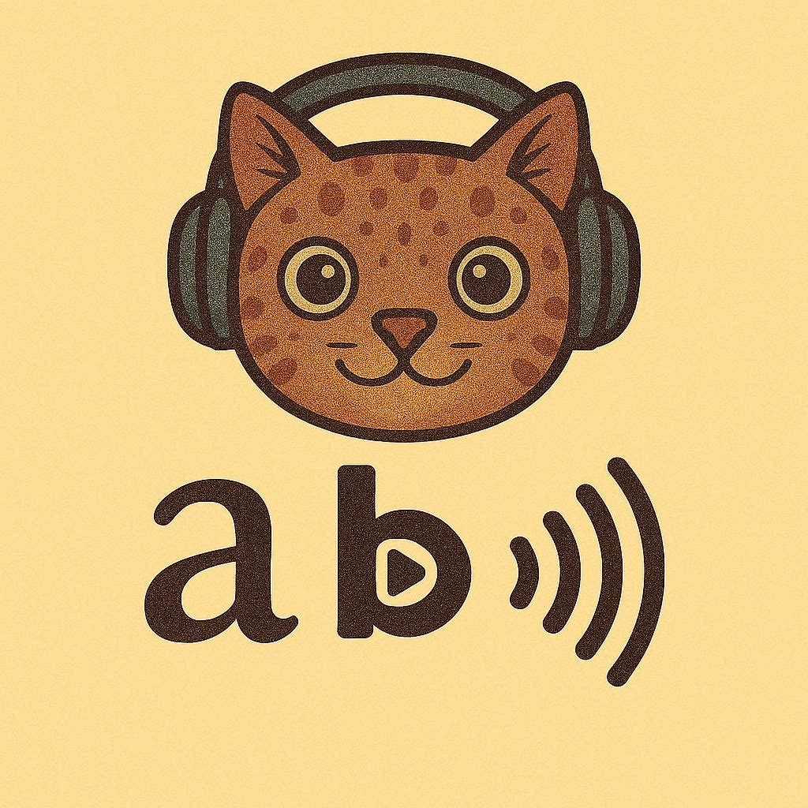

<p align="center">
  
</p>

<h1 align="center">Dittli TTS</h1>

<p align="center">
  Browser-first lightweight text-to-speech — forked from <a href="https://github.com/tronghieuit/tiny-tts">TinyTTS</a> by tronghieuit
</p>

---

~1.6M parameters · ~3.4 MB ONNX FP16 · 44.1 kHz · runs on CPU

Dittli TTS extends the original TinyTTS with German language support, a full adversarial training pipeline, and a multi-language Node.js runtime.

## Languages

| Language | Voice | Status |
|---|---|---|
| English | Male (original) | Shipped |
| German | Thorsten Voice (CC0) | Shipped |

---

## Browser (npm)

The npm packages are browser-only ESM (since v0.2.0) and run on top of
[onnxruntime-web](https://www.npmjs.com/package/onnxruntime-web). Install the
language pack(s) you need — `@dittli/tts-core` is pulled in automatically:

```bash
npm install @dittli/tts-en           # English
npm install @dittli/tts-de           # German
npm install @dittli/tts-en @dittli/tts-de  # both
```

```js
import { DittliTTS } from "@dittli/tts-en";

const tts = new DittliTTS({ language: "en" });
const wavBytes = await tts.speak("Hello, world!");

const url = URL.createObjectURL(new Blob([wavBytes], { type: "audio/wav" }));
new Audio(url).play();
```

`speak()` returns a `Uint8Array` containing a complete WAV file. The language
packs use `new URL(..., import.meta.url)` to point at the bundled `.onnx`
model and metadata JSON — Vite, Rollup, esbuild, and Webpack 5 emit them as
hashed static assets automatically.

Both languages in one app:

```js
import "@dittli/tts-en";
import "@dittli/tts-de";
import { DittliTTS } from "@dittli/tts-core";

const en = new DittliTTS({ language: "en" });
const de = new DittliTTS({ language: "de" });
```

Custom model URL (e.g. CDN-hosted):

```js
import { DittliTTS } from "@dittli/tts-core";
import "@dittli/tts-en"; // still needed for the G2P registration

const tts = new DittliTTS({
  language: "en",
  modelUrl: "https://cdn.example.com/dittli-en_fp16.onnx",
  metadataUrl: "https://cdn.example.com/dittli-en.json",
});
```

For Python / Node-side inference, use the Python package below.

## Python

```bash
pip install dittli-tts
```

```python
from dittli_tts import DittliTTS

tts = DittliTTS(checkpoint_path='checkpoints/G.pth')
tts.speak('Hello, world!', output_path='hello.wav')
```

German inference (requires a trained German checkpoint):

```bash
python -m dittli_tts.inference.engine \
    --lang DE --checkpoint checkpoints_de/G.pth \
    --text "Guten Morgen, wie geht es dir?"
```

## Training

See [docs/TRAINING_DE.md](docs/TRAINING_DE.md) for the full cloud training guide (Modal, Kaggle, Vast.ai).

**German fine-tune from the English checkpoint:**

```bash
bash scripts/setup_de_data.sh
python -m dittli_tts.data.preprocess \
    --metadata data/thorsten/metadata.csv \
    --wavs-dir data/thorsten/wavs
python scripts/finetune_de.py \
    --metadata data/thorsten/metadata.csv \
    --wavs-dir data/thorsten/wavs \
    --english-ckpt checkpoints/G.pth \
    --ckpt-dir checkpoints_de/
```

**English from scratch:**

```bash
bash scripts/setup_en_data.sh
python -m dittli_tts.data.preprocess \
    --metadata data/ljspeech/metadata.csv \
    --wavs-dir data/ljspeech/wavs \
    --language EN
python scripts/train_en.py \
    --metadata data/ljspeech/metadata.csv \
    --wavs-dir data/ljspeech/wavs \
    --ckpt-dir checkpoints_en/
```

---

## Repository layout

```
packages/               npm workspace — three published packages
  tts-core/             @dittli/tts-core   ONNX inference engine + CLI
  tts-en/               @dittli/tts-en     English G2P + model metadata
  tts-de/               @dittli/tts-de     German G2P + model metadata
src/
  dittli_tts/           Python package (training + Python inference)
    inference/          ONNX export, engine
    training/           trainer, losses, Modal cloud runner
    data/               dataset loader, preprocessor
    text/               G2P (English + German), symbol table
    utils/              config, train config, checkpoint tools
scripts/
  gen_metadata.py       regenerates Node.js JSON sidecars from Python config
  gen_de_rules.py       regenerates German G2P rules JSON from Python source
  finetune_de.py        German fine-tuning entry point
  train_en.py           English from-scratch training entry point
  setup_de_data.sh      downloads Thorsten Voice dataset
  setup_en_data.sh      downloads LJSpeech dataset
checkpoints/
  G.pth                 English checkpoint (committed, ~17 MB)
  symbols_v1_en.txt     symbol snapshot used by the German embedding remapper
docs/                   training guides, session notes
```

---

## Architecture: Python as source of truth

**Python owns the config; Node.js consumes generated artifacts.**

```
src/dittli_tts/text/symbols.py       ← symbol table (220 symbols)
src/dittli_tts/utils/config.py       ← model architecture + audio params
         │
         ▼  npm run g2p:metadata
         │  (python scripts/gen_metadata.py)
         │
packages/tts-en/metadata/dittli-en.json   ← generated
packages/tts-de/metadata/dittli-de.json   ← generated
         │
         ▼  loaded at runtime by @dittli/tts-core
```

Similarly, the German G2P rules JSON is generated from Python source:

```
src/dittli_tts/text/german.py
         │
         ▼  npm run g2p:gen
         │  (python scripts/gen_de_rules.py)
         │
packages/tts-de/src/g2p_de_rules.json     ← generated
```

**If you change symbols, language IDs, audio params, or German G2P rules, run:**

```bash
npm run g2p:metadata   # regenerates both language sidecars
npm run g2p:gen        # regenerates German G2P rules only
```

Both are committed — they are generated files but cheap to regenerate and useful to diff.

---

## Onboarding

### Prerequisites

- Node.js ≥ 18, npm ≥ 7
- Python ≥ 3.10, [uv](https://github.com/astral-sh/uv)
- GPU optional (CPU works for inference; GPU needed for training)

### Dev setup

```bash
git clone https://github.com/dittlihq/dittli-tts.git
cd dittli-tts

# Python env
uv sync

# Node.js workspace (links all three packages together)
npm install
```

`npm install` at the root links `@dittli/tts-core`, `@dittli/tts-en`, and `@dittli/tts-de` via the workspace symlinks, so you can `require('@dittli/tts-en')` immediately without publishing.

### Running tests

```bash
npm run test:unit        # Python unit tests (pytest tests/unit)
npm run test:parity      # JS/Python G2P parity tests
npm run test:integration # end-to-end inference tests
```

### Linting

```bash
npm run lint             # biome (JS) + ruff (Python)
npm run lint:fix         # auto-fix where possible
```

### Adding a new language

1. Add G2P logic in `src/dittli_tts/text/<lang>.py` and extend `symbols.py` with any new phonemes.
2. Add the language to `language_id_map` and `language_tone_start_map` in `symbols.py`.
3. Add the language entry to `scripts/gen_metadata.py` (`targets` dict).
4. Run `npm run g2p:metadata` to generate the sidecar.
5. Create `packages/tts-<lang>/` following the structure of `tts-en` or `tts-de`.
6. Port the G2P logic to JavaScript (`src/g2p_<lang>.js`).
7. Register it in `packages/tts-<lang>/src/index.js` via `DittliTTS.registerLanguage()`.

### Exporting an ONNX model

After training a new checkpoint:

```bash
python -m dittli_tts.inference.export \
    --checkpoint checkpoints/G.pth \
    --out models/dittli-en.onnx \
    --lang EN
```

Place the resulting `.onnx` next to its sidecar JSON when distributing or testing locally.

---

## License

Dittli TTS additions © 2026 Dittli TTS contributors, [Apache 2.0](./LICENSE).

Original TinyTTS © 2025 tronghieuit, Apache 2.0. See [NOTICE](./NOTICE).
