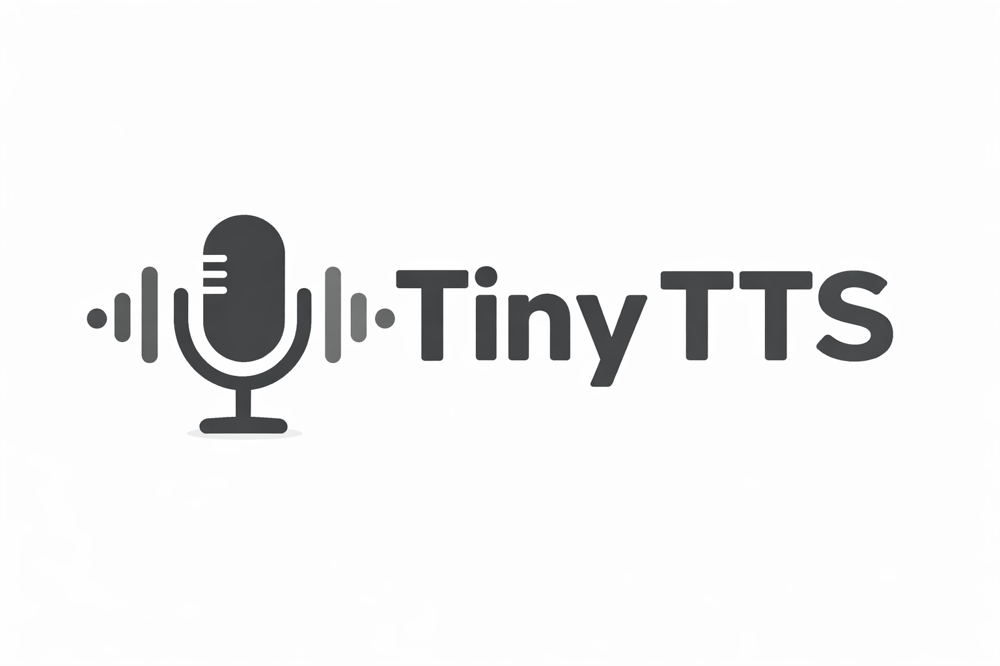

<p align="center">
  
</p>

<h1 align="center">TinyTTS</h1>

<p align="center">
  <b>Ultra-lightweight English Text-to-Speech — only 9M parameters, ~20 MB on disk</b>
</p>

<p align="center">
  <a href="https://huggingface.co/spaces/backtracking/tiny-tts-demo">
    
  </a>
</p>

---

## Highlights

TinyTTS is an end-to-end text-to-speech model that delivers natural-sounding speech with a fraction of the resources required by conventional TTS systems.

| Metric | TinyTTS | Typical TTS Models |
|---|---|---|
| **Parameters** | **~9M** | 50M–200M+ |
| **Checkpoint size** | **~20 MB** | 200 MB–1 GB+ |
| **Sample rate** | 44.1 kHz | 22.05–44.1 kHz |
| **End-to-end** | Yes | Often requires separate vocoder |

With only **9 million parameters** and a checkpoint of just **~20 MB**, TinyTTS runs comfortably on CPU-only machines, edge devices, and embedded systems — making real-time speech synthesis accessible without a GPU.

---

## Installation

### From source (pip install)

```bash
git clone https://github.com/tronghieuit/tiny-tts.git
cd tiny-tts
pip install -e .
```

After installing, the `tiny-tts` command is available globally:

```bash
tiny-tts --checkpoint checkpoints/G.pth --text "Hello world" --device cuda
```

### Dependencies only

```bash
pip install torch torchaudio soundfile g2p-en transformers numba
```

---

## Quick Start

### Basic inference

```bash
tiny-tts \
  --text "The weather is nice today, and I feel very relaxed." \
  --checkpoint checkpoints/G.pth \
  --output output.wav \
  --speaker female \
  --device cuda
```

### CPU inference

```bash
tiny-tts \
  --text "The weather is nice today, and I feel very relaxed." \
  --checkpoint checkpoints/G.pth \
  --device cpu
```

### Synthesize with all speakers

```bash
tiny-tts \
  --text "Testing all available speakers." \
  --checkpoint checkpoints/G.pth \
  --speaker all
```

Output files are saved to `infer_outputs/`.

---

## Python API

You can easily use TinyTTS directly in your Python code:

```python
from tiny_tts import TinyTTS

# Initialize the TTS model (auto-detects device and downloads default checkpoint if missing)
tts = TinyTTS()
# OR specify a custom checkpoint: tts = TinyTTS(checkpoint_path="...")

# Synthesize a single sentence
tts.speak("Hello, this is a test of the Python API.", output_path="hello.wav")

# Synthesize a long paragraph (5 sentences)
paragraph = (
    "TinyTTS is an ultra-lightweight text-to-speech model. "
    "It has only nine million parameters, which makes it extremely fast. "
    "You can run it easily on your local CPU without a dedicated graphics card. "
    "The audio quality remains surprisingly clear despite the small model size. "
    "I hope you enjoy building exciting applications with it!"
)
tts.speak(paragraph, output_path="paragraph.wav")
```

**🔊 Listen to the result (3.5 seconds) - [Download WAV](assets/paragraph.wav)**

https://github.com/tronghieuit/tiny-tts/raw/main/assets/paragraph.mp4

---

## Inference Benchmarks

Benchmarked on real hardware with the sentence:  
*"Hello there, I am testing the English text to speech system."* (~3.77s of audio at 44.1kHz)

- **GPU**: NVIDIA GeForce RTX 4060 Laptop GPU  
- **CPU**: Intel CPU (same machine)  
- **PyTorch**: 2.5.1+cu121  
- **Model**: 9.84M parameters, 19.1 MB checkpoint

### CPU

| Metric | Value |
|---|---|
| Model load time | 0.204 s |
| Text processing time | 0.087 s |
| Synthesis time (avg, 5 runs) | **0.454 s** |
| Synthesis time (min) | 0.439 s |
| Synthesis time (max) | 0.486 s |
| Real-Time Factor (RTF) | **0.12x** |

> RTF < 1.0 means faster than real-time. TinyTTS synthesizes 3.77s of audio in just 0.45s on CPU — approximately **8x real-time**.

### GPU (CUDA)

| Metric | Value |
|---|---|
| Model load time | 0.351 s |
| Text processing time | 0.001 s |
| Synthesis time (avg, 5 runs) | **0.056 s** |
| Synthesis time (min) | 0.052 s |
| Synthesis time (max) | 0.061 s |
| Real-Time Factor (RTF) | **0.015x** |
| Peak VRAM usage | 126.8 MB |

> On GPU, TinyTTS synthesizes 3.77s of audio in just 0.056s — approximately **67x real-time**.

### CPU vs GPU vs ONNX Summary

```text
Device       | Synthesis Time | RTF     | Speed vs Real-time
-------------|---------------|---------|--------------------
CPU (PyTorch)| 0.454 s       | 0.120x  | ~8x faster
CPU (ONNX)   | 0.609 s       | 0.172x  | ~5.8x faster
GPU (PT CUDA)| 0.056 s       | 0.015x  | ~67x faster
```

> **Note on ONNX**: Because TinyTTS is so small (~9M params), PyTorch's native inference is actually *faster* than ONNX Runtime on CPU due to lower graph overhead. ONNX is provided primarily for cross-platform deployment.

---

## CLI Arguments

| Argument | Short | Default | Description |
|---|---|---|---|
| `--text` | `-t` | *"The weather is nice today..."* | Text to synthesize |
| `--checkpoint` | `-c` | *(optional)* | Path to `G.pth`. Auto-downloads if omitted. |
| `--output` | `-o` | `english_test.wav` | Output audio filename |
| `--speaker` | `-s` | `female` | Speaker ID |
| `--device` | | `cuda` | Device: `cuda` or `cpu` |

---

## Project Structure

```
tiny-tts/
├── infer.py                  # Main inference script
├── TinyTTS.png               # Project logo
├── setup.py                  # Package setup (pip install)
├── pyproject.toml            # Build configuration
├── checkpoints/
│   └── G.pth                 # Pre-trained checkpoint (~20 MB)
├── models/
│   └── synthesizer.py        # Model definition
├── nn/
│   ├── attentions.py         # Attention layers
│   ├── modules.py            # Neural network modules
│   ├── commons.py            # Utility functions
│   └── transforms.py         # Flow transforms
├── text/
│   ├── english.py            # English G2P pipeline
│   ├── symbols.py            # Phoneme symbol tables
│   ├── cmudict.rep           # CMU Pronouncing Dictionary
│   └── english_utils/        # Text normalization
├── alignment/
│   └── core.py               # Viterbi alignment
└── utils/
    └── config.py             # Model hyperparameters
```

---

## TODO

- [ ] Public source code for training
- [ ] Add more English speakers
- [ ] Add ultra-lightweight zero-shot voice cloning
- [ ] Release an even smaller model version while maintaining high accuracy

---

## License

Licensed under the [Apache License, Version 2.0](LICENSE).
